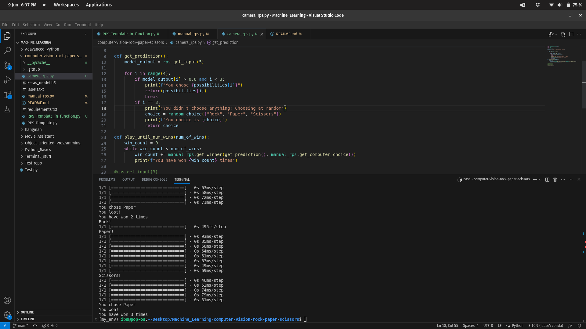

# Computer Vision RPS

## To begin, run python3 comera_rps.py in the terminal (after installing requirements.txt)

This is a program to play rock paper scissors either via gesturing to the webcam or entering an input from the keyboard. The keyboard implementation simply uses functions to decide a winner once the user selects an input.

The webcam version uses a machine trained from "Teachable machine" to recognize a hand gesture from a webcam and inputs that into the same logic as the keyboard version. The model is contained in the file keras_model.h5.

The machine version was created in a conda enviroment and it's requirements are found in the requirements.txt file.

The file RPS-Template.py runs a script which activates the webcam and runs the machine which assings a probability of rock, paper, and scissors to the current frame.

The camera_rps.py file plays rock paper scissors until the user wins a set number of times.

